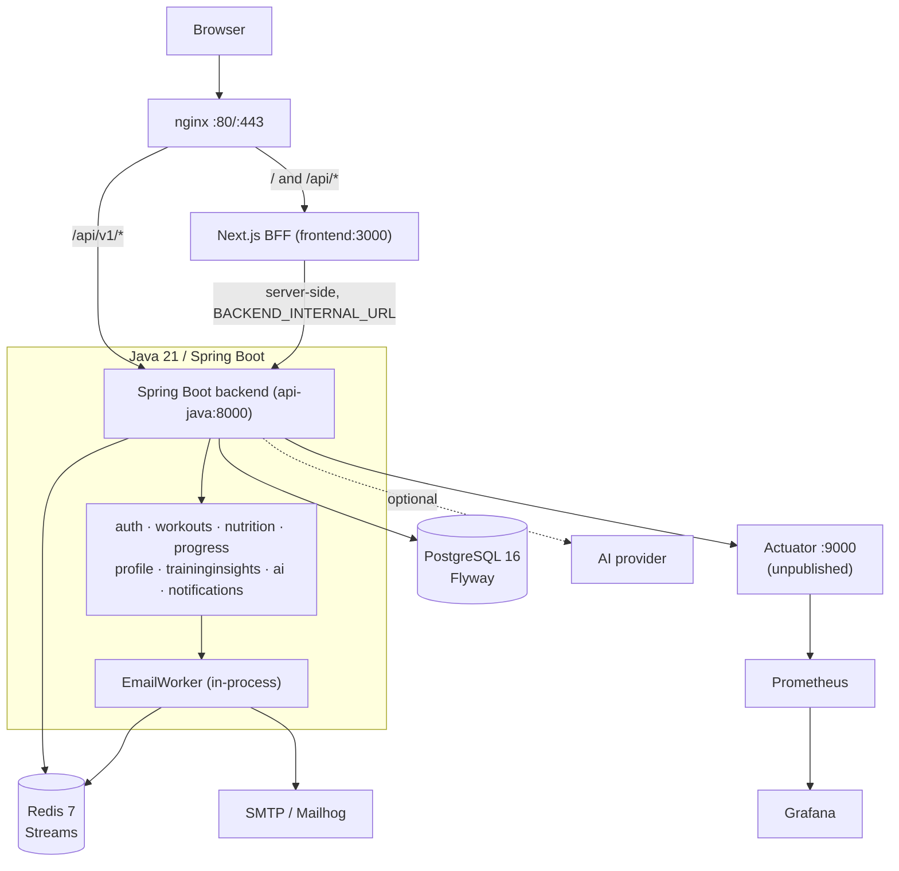
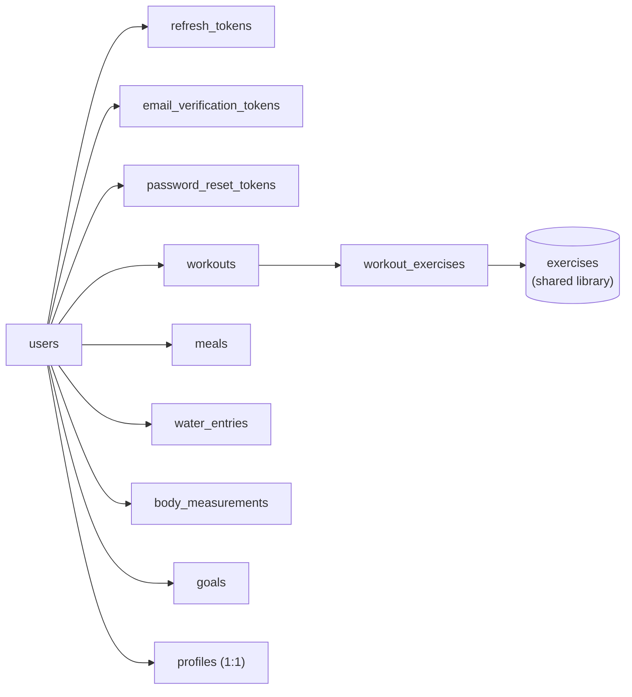

# Architecture

## System overview

A Next.js frontend acting as a backend-for-frontend (BFF), a Java 21 / Spring Boot backend,
and PostgreSQL/Redis for storage and background work. nginx sits in front and splits traffic
by path.



**Why the BFF exists.** The browser never holds a JWT. Next.js Route Handlers keep the
access and refresh tokens in httpOnly cookies and call the backend server-side over the
Docker network, so a token cannot be read by client-side JavaScript. That is the reason the
BFF exists rather than the browser calling the API directly.

**Synchronous vs asynchronous.** Everything the user waits for is a direct call into the
backend and then PostgreSQL. The one asynchronous path is transactional email: registration
and password reset append to a Redis Stream and return immediately, and an in-process worker
consumes it. A Redis outage degrades to "no email", never to "registration failed".

## Backend layout

`backend-java/src/main/java/com/fitnesstracker/`

```
├── common/
│   ├── api/          ApiResponse, ErrorResponse, ErrorCode — the shared envelope
│   ├── exception/    AppException, GlobalExceptionHandler
│   ├── persistence/  PgEnumUserType — native PostgreSQL enum binding
│   ├── validation/   StrongPassword
│   └── web/          CorrelationIdFilter, PgEnumConverterFactory
├── config/           Jackson, password encoder, clock
├── security/         JWT filter, TokenService, SecurityConfig
├── health/           /api/v1/health and /api/v1/ready
├── auth/             users, tokens, rotation, reuse detection, email verification
├── workouts/         exercise library, workouts, workout-exercises
├── nutrition/        meals, water entries, daily summary
├── progress/         body measurements, goals
├── profile/          one profile row per user
├── traininginsights/ deterministic analytics (pure domain, no I/O)
├── ai/               provider boundary, AiService, TrainingInsightExplainer
└── notifications/    Redis Streams dispatcher and EmailWorker
```

Every feature module follows the same shape: `entity/` (JPA), `dto/` (request and response
records), `repository/` (Spring Data), `service/` (business logic), `controller/` (HTTP).
Controllers do no business logic and services do no HTTP.

Two module-level rules are load-bearing:

- **`traininginsights/domain` is pure.** `TrainingAnalytics` and `AnalyticsNumbers` have no
  repository, no clock injection beyond what is passed in, and no provider calls. That is
  what makes a training verdict reproducible.
- **The `ai` module may read, never compute.** It receives already-computed results and
  rephrases them; it cannot change a classification or a metric.

## Frontend layout

```
frontend/
├── app/
│   ├── (app)/            authenticated route group — wrapped in AppShell (sidebar/nav)
│   │   ├── dashboard/  workouts/  nutrition/  progress/  ai/  profile/
│   ├── login/  register/  forgot-password/  reset-password/  verify-email/
│   └── api/                the BFF — one route per backend resource, all proxying through
│                            lib/auth/authedFetch.ts
├── components/
│   ├── ui/                 shadcn/ui primitives (vendored, unmodified)
│   ├── common/               DeleteEntityButton (shared across every detail page)
│   ├── layout/                AppShell, nav-items
│   └── {workouts,nutrition,progress,profile,dashboard}/   feature-specific components
└── lib/
    ├── auth/                cookies, backend fetch, refresh, authedFetch, AuthContext
    └── validation/            zod schemas, one per domain, mirroring backend Pydantic schemas
```

## Data model

Six domain tables, all keyed to `users` by `user_id` with `ondelete="CASCADE"` except
`exercises`, which is a shared, seeded library:



The schema is owned by Flyway (`backend-java/src/main/resources/db/migration`), and
`spring.jpa.hibernate.ddl-auto=validate` means a drifting entity mapping fails startup rather
than silently altering the database. Migrations are additive and hand-written —
which only imports `auth.models` for metadata discovery, confirming the later migrations
so a release can be rolled back to the previous image without a schema change.

## Request lifecycle (example: creating a workout)

1. The browser POSTs to `/api/workouts` — the Next.js BFF, not the backend.
2. The Route Handler reads the `ff_access` httpOnly cookie and calls
   `http://api-java:8000/api/v1/workouts` over the Docker network.
3. `JwtAuthenticationFilter` validates the token and populates the security context.
4. `WorkoutController` binds and validates the request record.
5. `WorkoutService` (inside a transaction) checks that every `exercise_id` is visible to
   this user, then persists the workout and its exercises.
6. The response is wrapped in the shared `ApiResponse` envelope and carries the
   correlation id assigned by `CorrelationIdFilter`.
7. If anything throws, `GlobalExceptionHandler` maps it to the shared error envelope — no
   stack trace, SQL or provider detail ever reaches the client.

## Observability

Every request gets an `X-Correlation-ID` (generated if not already present) via
`CorrelationIdMiddleware`, echoed in both the response header and every structured error
envelope — so a user-reported error can be traced back to a specific backend log line without
needing a request timestamp to correlate.
