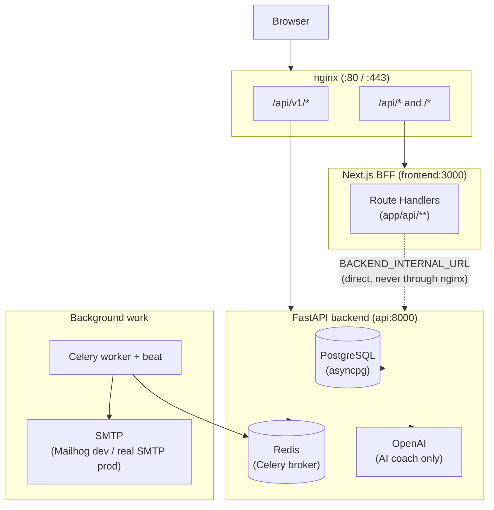
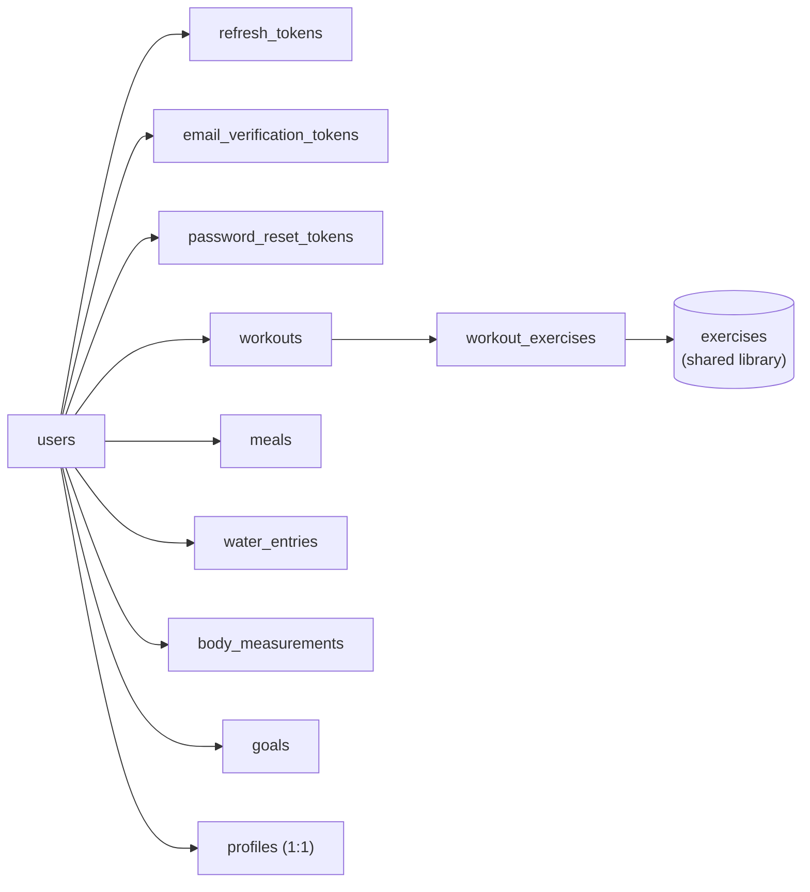

# Architecture

## System overview

Fitness Tracker is a three-tier system: a Next.js frontend acting as its own backend-for-frontend
(BFF), a FastAPI backend, and PostgreSQL/Redis for storage and background work. nginx sits in
front of both, splitting traffic by path.



See [ADR 005](adr/005-nginx-path-routing-split.md) for why the nginx split is on the `/v1/`
segment rather than per-resource, and [ADR 002](adr/002-bff-pattern-httponly-cookies.md) for why
the BFF exists at all rather than the browser calling FastAPI directly.

## Backend layout

```
backend/app/
├── config.py           Settings (pydantic-settings, env-driven)
├── core/                Database engine, security (JWT/Argon2), email, exceptions,
│                        logging, middleware, Redis client
├── dependencies.py      get_db, get_current_user (FastAPI DI)
├── api/v1/              health/ready probes, api_v1_router aggregation
└── modules/
    ├── auth/            users, refresh tokens, email verification, password reset
    ├── workouts/         exercise library, user workouts
    ├── nutrition/         meals, water entries, daily summary
    ├── progress/          body measurements, goals
    ├── profile/           single-row-per-user profile
    └── ai/                 OpenAI-backed generation and chat
```

Every module follows the same internal shape: `models.py` (SQLAlchemy ORM), `schemas.py`
(Pydantic request/response), `service.py` (business logic, DB access), `routes.py` (FastAPI
router). Routes never touch the DB directly — they call into `service.py`, which is what the
test suite exercises through the real HTTP layer via `tests/conftest.py`'s `client` fixture.

## Frontend layout

```
frontend/
├── app/
│   ├── (app)/            authenticated route group — wrapped in AppShell (sidebar/nav)
│   │   ├── dashboard/  workouts/  nutrition/  progress/  ai/  profile/
│   ├── login/  register/  forgot-password/  reset-password/  verify-email/
│   └── api/                the BFF — one route per backend resource, all proxying through
│                            lib/auth/authedFetch.ts
├── components/
│   ├── ui/                 shadcn/ui primitives (vendored, unmodified)
│   ├── common/               DeleteEntityButton (shared across every detail page)
│   ├── layout/                AppShell, nav-items
│   └── {workouts,nutrition,progress,profile,dashboard}/   feature-specific components
└── lib/
    ├── auth/                cookies, backend fetch, refresh, authedFetch, AuthContext
    └── validation/            zod schemas, one per domain, mirroring backend Pydantic schemas
```

## Data model

Six domain tables, all keyed to `users` by `user_id` with `ondelete="CASCADE"` except
`exercises`, which is a shared, seeded library:



Every migration is additive and hand-written (not autogenerated) — see `backend/alembic/env.py`,
which only imports `auth.models` for metadata discovery, confirming the later migrations
(003–006) were never relying on Alembic's autogenerate diffing against the full model set.

## Request lifecycle (example: creating a workout)

1. Browser submits `WorkoutForm` → `POST /api/workouts` (Next.js Route Handler).
2. The route handler calls `authedBackendFetch`, which attaches the access-token cookie and
   calls FastAPI directly over the Docker network.
3. FastAPI's `workouts_router` → `workouts_service.create_workout` → validates every
   `exercise_id` exists, inserts `Workout` + `WorkoutExercise` rows, commits.
4. Response flows back through the BFF (which may rotate cookies if a silent refresh happened)
   to the browser, which redirects to the new workout's detail page.

## Observability

Every request gets an `X-Correlation-ID` (generated if not already present) via
`CorrelationIdMiddleware`, echoed in both the response header and every structured error
envelope — so a user-reported error can be traced back to a specific backend log line without
needing a request timestamp to correlate.
